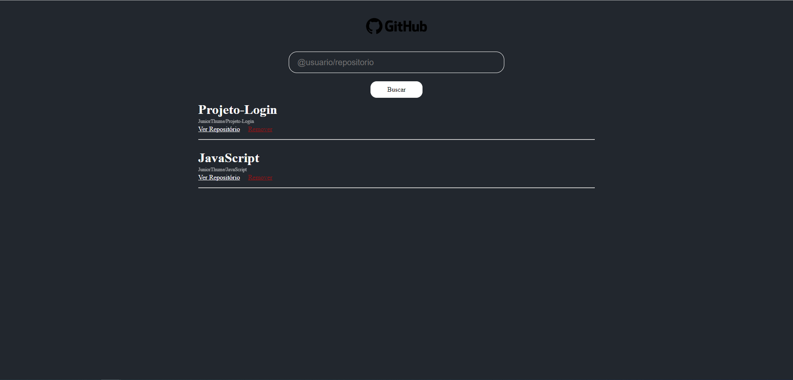

# GitFind Repositories

## Descrição do projeto prático
Este é um desafio proposto com o intuito de permitir a busca por repositórios de usuários do *GitHub* e exibí-los com algumas informações como o nome e dono do repositório, como também a descrição do repositório.
### Tecnologias utilizadas
  - React
    - JavaScript
    - Hooks:
      - useState
  - Styled Components
  - Axios
      
## Como rodar
  - Primeiramente, clone este repositório:

        git clone https://github.com/JuniorThume/GitFindRepositories.git

  - Instale as dependências do projeto

        npm install

  - Execute e experimente o app

        npm run
